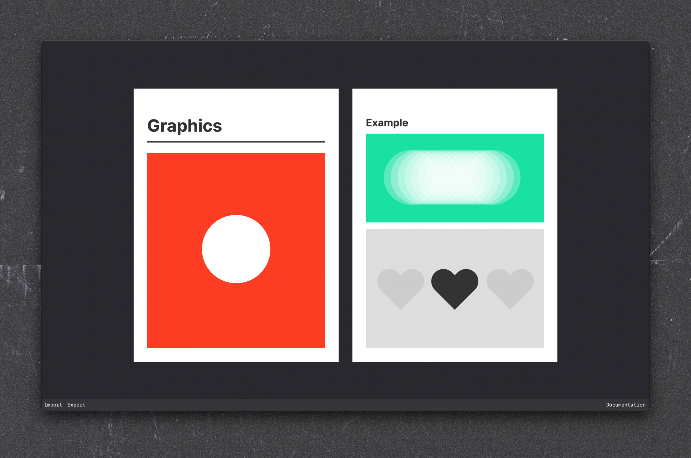

# Canvas



Canvas is a small browser-based design tool. It supports basic vector shapes and makes heavy use of the keyboard for editing. Since it is written in plain JavaScript it’s very light and portable.

I created the tool for myself but chose to make it available as free open-source software. If you have any suggestions or improvements, feel free to open an issue or create a pull request.

## Links

* [Web version](https://canvas.larsaugustin.com)
* [Documentation](https://canvas.larsaugustin.com/resources/documentation/index.html)
* [Contact me](mailto:lars@larztech.com)

## Tricks

* **Default colors:** In addition to every CSS color, a few custom color presets are available: `.red`, `.orange`, `.yellow`, `.green`, `.mint`, `.blue`, `.pink`
* **Multiline text:** Line breaks can be added with semicolons

## To Do

* Vector import
* SVG export
* Touch support
* Easy way to run it locally

## Files

Files are exported as `json`. The default file looks like this:

```json
{
    "name": "New Document",
    "offsetX": 150,
    "offsetY": 150,
    "scale": 1.2,
    "artboards": [
        {
            "color": "#FFFFFF",
            "x": 0,
            "y": 0,
            "width": 300,
            "height": 300,
            "layers": []
        }
    ]
}
```

As you can see, the state of the canvas is saved along with the actual document. This allows for state restoration when a document is reopened. There is also a `name` property, which is the name of the project. It’s used for the name of the tab inside a web browser and the name of the exported file.

## License

This project is licensed under the MIT license. View `LICENSE` for more info.